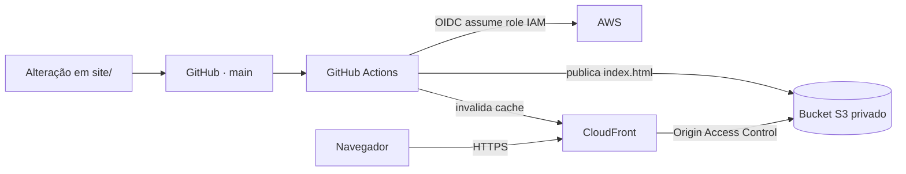

# DevOps Lab

Projeto de portfólio que demonstra infraestrutura como código e entrega automatizada de um site estático na AWS.

**Demonstração:** [DevOps Lab](https://d352ryjwl42oc2.cloudfront.net)

## O que foi implementado

- Dashboard responsivo em HTML, CSS e JavaScript, servido como arquivos estáticos.
- Infraestrutura AWS definida com Terraform: bucket S3 privado, CloudFront, Origin Access Control e políticas de acesso.
- Publicação contínua pelo GitHub Actions quando há alterações no site ou no workflow em `main`.
- Autenticação do workflow na AWS por OIDC, sem chaves de acesso AWS armazenadas no GitHub.
- Envio do site ao S3 e invalidação do cache do CloudFront após a publicação.
- Prévia local do dashboard em um container Nginx via Docker Compose.

## Arquitetura



O bucket bloqueia acesso público. O CloudFront lê os arquivos por meio do Origin Access Control. A política de deploy limita o workflow ao envio da página e à invalidação da distribuição. O dashboard não consulta API, banco de dados ou cluster em tempo real.

## Tecnologias

| Área | Tecnologias |
| --- | --- |
| Site | HTML, CSS e JavaScript |
| Hospedagem | Amazon S3, CloudFront e Origin Access Control |
| Infraestrutura como código | Terraform |
| Entrega contínua | GitHub Actions e OIDC |
| Prévia local | Docker, Docker Compose e Nginx |

## Executar a prévia local

Na raiz do repositório:

```bash
docker compose up --build -d dashboard
```

Acesse [http://localhost:8081](http://localhost:8081). A prévia do dashboard não inicia nem depende da API ou do PostgreSQL.

Para parar a prévia:

```bash
docker compose stop dashboard
```

## Provisionar a hospedagem

A configuração Terraform do site está em `terraform/aws/static-site`. Ela requer credenciais AWS com as permissões necessárias, um nome de bucket S3 globalmente único e a role OIDC do GitHub Actions referenciada pelo projeto.

```bash
cd terraform/aws/static-site
terraform init
terraform plan -var="site_bucket_name=SEU_BUCKET_UNICO"
terraform apply -var="site_bucket_name=SEU_BUCKET_UNICO"
```

O workflow usa as variáveis do repositório `DASHBOARD_S3_BUCKET` e `DASHBOARD_CLOUDFRONT_DISTRIBUTION_ID`. Os outputs do Terraform fornecem esses valores e o domínio CloudFront.

## Laboratório complementar

O repositório também contém exercícios independentes de Kubernetes e automação desenvolvidos em etapas anteriores: manifests Kubernetes, configurações Helm, scripts Linux e registros de troubleshooting. Esses materiais documentam o laboratório local; não fazem parte da hospedagem nem do deploy do dashboard.

## Estrutura principal

```text
site/                         Dashboard estático e imagem Docker
terraform/aws/static-site/    Infraestrutura AWS do site
.github/workflows/deploy.yml  Pipeline de publicação
app/api/                      API Flask para exercícios locais
kubernetes/                   Manifests do laboratório Kubernetes
helm/                         Valores Helm de Prometheus e Grafana
scripts/                      Automação do ambiente Linux/Kubernetes
docs/                         Documentação e troubleshooting
```
